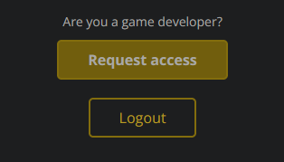
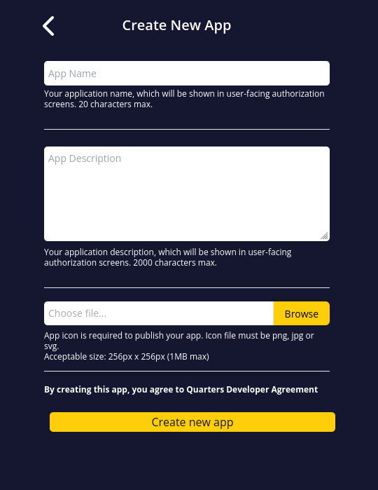
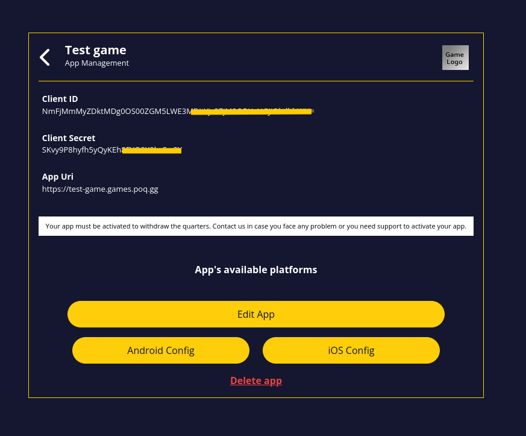

# POQ - OAuth API

The OAuth API allows developers to use the OAuth2 protocol and grants their 3rd
party application full or partial access to a `Pocketful Of Quarters` (`PoQ`)
user account. This page will guide you through the integration process.

## Create a Quarters application

- If you don't have a PoQ account yet, create one at
  [https://www.poq.gg/login](https://www.poq.gg/login);
- You will also need to request the Game Developer role to gain access to the
  Game Dashboard. For this, head towards [your user
  profile](https://www.poq.gg/profile):

  
- Once your request have been approved, head to
[https://poq.gg/dev](https://poq.gg/dev), click the 'Create' button and fill out
the self-explanatory creation form:

  

- Finally, you will be taken to your app's page:
_(`https://poq.gg/manage_app?edit=true&id=<your_app_id>`)_, where you will find
your public and secret keys:

  

---

## Integration via Authorization Flow

### 1 - Send your users to the authorization page, to request the access

```CURL
GET https://www.poq.gg/api/v1/oauth2/authorize?response_type=code&client_id=YOUR_CLIENT_ID&redirect_uri=YOUR_REDIRECT_URL&scope=email
```

| Parameter       | Required | Description                                                   |
| --------------- | -------- | ------------------------------------------------------------- |
| `response_type` | yes      | Must be `code`.                                               |
| `client_id`     | yes      | The value of the `client_id` field, _(see above screenshot)_. |
| `redirect_uri`  | yes      | The URL _(encoded)_ to redirect the users back to your app.   |
| `scope`         | yes      | Space delimited list of scopes                                |

**Available scopes:**

- `identity`: Identity of the PoQ user: `{ id, gamerTag, avatar }`;
- `email`: Same as `identity`, with the additional field `{ email }`.
- `wallet`: Allows for querying info about a user's wallet.
- `transactions`: Allows making transactions in behalf of the user.

### 2 - `PocketfulOfQuarters` redirects the users back to your app

If the user approves your authorization request, they will be redirected back to
your `redirect_uri` with a temporary code parameter.

```CURL
GET https://test-game.games.poq.gg/poq_auth/success?code=eyJhbGciOiJIUzI1NiIsInR5
```

> `redirect_uri` is an auto-generated url for your game

### 3 - Request the access token

You can now use the `code` passed to your `redirect_uri` page to request the
`PoQ` access token from your backend.

```CURL
POST https://www.poq.gg/api/oauth2/token
```

With the following parameters (`application/x-www-form-urlencoded`):

| Parameter       | Required | Description                                                   |
| --------------- | -------- | ------------------------------------------------------------- |
| `client_id`     | yes      | Value of the `client_id` field, _(see above screenshot)_.     |
| `client_secret` | yes      | Value of the `client_secret` field, _(see above screenshot)_. |
| `grant_type`    | yes      | Must be `authorization_code`.                                 |
| `code`          | yes      | Value from step (2).                                          |
| `redirect_uri`  | yes      | Same value as step (2).                                       |

The response's json:

```javascript
{
  token_type: "bearer",
  expires_in: 3600,
  access_token: "the_new_access_token",
  refresh_token: "the_new_refresh_token",
  scope: "scope_requested_on_step_1"
}
```

### 4 - Refreshing the access token

You can get a new `access_token` when the previous one expires, by calling the
same endpoint:

```CURL
POST https://www.poq.gg/api/oauth2/token
```

With the following parameters (`application/x-www-form-urlencoded`):

| Parameter       | Required | Description                                                   |
| --------------- | -------- | ------------------------------------------------------------- |
| `client_id`     | yes      | Value of the `client_id` field, _(see above screenshot)_.     |
| `client_secret` | yes      | Value of the `client_secret` field, _(see above screenshot)_. |
| `grant_type`    | yes      | Must be `refresh_token`.                                      |
| `refresh_token` | yes      | `refresh_token` received from step (3).                       |
| `scope`         | no       | Same scope as initial, or restricted.                         |

> **Note**: Refresh tokens are valid for a duration of 6 months. Beyond that,
> the user will need to go through the authorization flow again.

(Same response as described in step (3)).

### 5. Make an API call

After you have a valid access token, you can make your first API call:

```curl
curl https://www.poq.gg/api/v1/users/@me -H 'Authorization: Bearer <your_access_token>'
```

Example response:

```javascript
{
  id: "aZKj1ae58awWEF63",
  gamerTag: "User1",
  avatar: "ccc954.png", // Full URL: https://api.poq.gg/images/${id}/${avatar}
  email: "user1@example.com", // email scope only
}
```

### 6. Putting it all together

- Create a new development app for yourself: `https://poq.gg/dev`
- Use `http://localhost:7777` as the App Url;
- Save the following code as `test.js`:

```javascript
const { URL } = require("url");
const express = require("express");
const got = require("got").default;

const CLIENT_ID = ""; // insert your client_id here
const CLIENT_SECRET = ""; // insert your client_secret here
const LINK = "https://s2w-dev-firebase.herokuapp.com/"; // for production, please use https://www.poq.gg
const SCOPE = "identity";
const PORT = 7777;

const demo = `http://localhost:${PORT}`;

const url = new URL("/api/oauth2/authorize", LINK);
url.searchParams.set("response_type", "code");
url.searchParams.set("scope", SCOPE);
url.searchParams.set("redirect_uri", demo);
url.searchParams.set("client_id", CLIENT_ID);

const main = `
<html>
  <head>
  </head>
  <body>
    <a href="${url.toString()}">Connect</a>
  </body>
</html>
`;

const app = express();

async function getInfo(code) {
  const response1 = await got.post("api/oauth2/token", {
    prefixUrl: LINK,
    form: {
      code,
      grant_type: "authorization_code",
      client_id: CLIENT_ID,
      client_secret: CLIENT_SECRET,
      redirect_uri: demo,
    },
    responseType: "json",
  });

  const response2 = await got.get("api/v1/users/me", {
    prefixUrl: LINK,
    headers: {
      Authorization: `Bearer ${response1.body.access_token}`,
    },
    responseType: "json",
  });

  return response2.body;
}

app.get("/", (req, res) => {
  if (!req.query.code) {
    res.setHeader("Content-Type", "text/html; charset=UTF-8");
    return res.status(200).send(main);
  } else {
    getInfo(req.query.code)
      .then((response) => res.send(response))
      .catch((error) => res.send(error));
  }
});

app.listen(PORT, () => {
  console.log(`Server is running on ${demo}`);
});
```

- Cut and paste the `client_id` and `client_secret` from the app page, into the
  code above;
- Install got and express and then run the test code;

```javascript
npm install got express
node test.js
```

- Open `http://localhost:7777` in your browser, and click "connect". Authorize
  the app, and it will show the results of the API call that look something like
  this:

```json
{
  "id": "XlPgcK8nfObx9wdIz2NU6087pfp2",
  "gamerTag": "Mike2001",
  "avatar": "a51bed3a9b527fe45e9d65c23aa76ece.png"
}
```

- When you are ready to go to production, please repeat these steps but:

  a) Use `https://apps.pocketfulofquarters.com/apps/new` to create a production
  app;

  b) In demo.js, replace LINK with:

```javascript
const LINK = "https://www.poq.gg"; // for development, you can use https://s2w-dev-firebase.herokuapp.com/
```

## Integration via Authorization Flow with Proof Key for Code Exchange (PKCE)

If your application has no server component and is a public application (native
apps, whether mobile or desktop) it is unadvisable to use the above flow as it
would require you to store your application's secret inside of the app, all
public applications can be mined for the secrets they contain thus making this
unadvisable, instead we offer the same flow with some slight modifications that
makes it usable by public applications without the need for storing secret
credentials

### 0 - Create a code verifier and derive a code challenge from it

Your application should generate a cryptographically random string between 43
and 128 characters that can only contain standard ASCII latin letters (both
upper case and lower case allowed), digits, underscores, hyphens and tildes. It
is advised to generate such a string with a cryptographically random number
generator with at least 256-bits of entropy. We will call this string **code
verifier** from here on out.

Next to generate the code challenge, the string must be hashed using the SHA256
algorithm. Then the resulted hash must be encoded using
[base64url](https://datatracker.ietf.org/doc/html/rfc4648#section-5) encoding.
(standard base64 encoding with + and / swapped for - and \_ and no padding at
the end)

### 1 - Send your users to the authorization page, to request the access

This is almost identical to step 1 without PKCE with two minute differences in
the query parameters: `code_challenge` and `code_challenge_method`

| Parameter               | Required | Description                                                        |
| ----------------------- | -------- | ------------------------------------------------------------------ |
| `code_challenge_method` | yes      | Must be `S256`.                                                    |
| `code_challenge`        | yes      | The code challenge generated in step 0, derived from code verifier |
| `response_type`         | yes      | Must be `code`. (Same as without PKCE)                             |
| `client_id`             | yes      | (Same as without PKCE)                                             |
| `redirect_uri`          | yes      | (Same as without PKCE)                                             |
| `scope`                 | yes      | (Same as without PKCE)                                             |

### 2 - PoQ redirects the user back to your app

This step is identical to step 2 without PKCE, they will also be redirected with
code and state (if present in step 1) or error and state (if something went
wrong)

### 3 - Request the access token

Again very similar to step 3 without PKCE, but instead of sending
`client_secret` the code verifier, as generated in step 0, is sent. (Reminder,
the body must be encoded with `application/x-www-form-urlencoded`)

| Parameter       | Required | Description                                         |
| --------------- | -------- | --------------------------------------------------- |
| `code_verifier` | yes      | The code verifier generated in step 0               |
| `client_id`     | yes      | (Same as without PKCE)                              |
| `grant_type`    | yes      | Must be `authorization_code`.(Same as without PKCE) |
| `code`          | yes      | Value from step (2). (Same as without PKCE)         |
| `redirect_uri`  | yes      | Same value as step (2). (Same as without PKCE)      |

### 4 & 5 - Refreshing access token and making requests

Nothing changes about refreshing the access token or making requests with the
acquired access token.

## Endpoints available - v1

Typical failed call of an endpoint:

```json
{
  "error": "error_type",
  "error_description": "..."
}
```

### `GET /api/v1/users/@me`

Fetches a user's account information.

- Scope: `identity` || `email`

```sh
curl -H "Authorization: Bearer <your-token>" https://www.poq.gg/api/v1/users/me

# Response: {
#   "id": "XlPgcK8nfObx9wdIz2NU6087pfp2",
#   "gamerTag": "Mike2001",
#   "avatar": "a51bed3a9b527fe45e9d65c23aa76ece.png",
#   "email": "user@isp.dom"
# }
```

---

### `GET /api/v1/wallets/@me`

Fetches a user's wallet information.

- Scope: `wallet`

```sh
curl -H "Authorization: Bearer <your-token>" https://www.poq.gg/api/v1/wallets/@me

# Response: {
#   "balance": 1000,
# }
```

---

### `POST /api/v1/transactions`

Transfers Quarters between your app and a user, or vice versa.

- ⚠️ Important notes: ⚠️

  - Before your app can take Quarters from users, it will need to be vetted by
    our staff. To request verification, you can reach out on:
    https://discord.com/invite/poq.

- Scope:

  - user -> app: `transactions`;
  - app -> user: none;

- Parameters:

| Name          | Type    | Description                                            |
| ------------- | ------- | ------------------------------------------------------ |
| `creditUser`  | integer | The Quarters to transfer to the user. Can be negative. |
| `description` | string  | (optional) A label for the transaction.                |
|               |         |                                                        |

- Code example:

```sh
# /!\ On Windows, escape the double-quotes around the payload's fields
# /!\ On Windows 10, the powershell command `curl` isn't the "actual" curl

# Give 20 Quarters to a user
curl -X POST \
  -H "Authorization: Bearer <your-token>" \
  -H "Content-Type: application/json" \
  -d '{"creditUser":20}' \
  https://www.poq.gg/api/v1/transactions


# Take 50 Quarters from a user
curl -X POST \
  -H "Authorization: Bearer <your-token>" \
  -H "Content-Type: application/json" \
  -d '{"creditUser":-50, "description":"Entry fee for ..."}' \
  https://www.poq.gg/api/v1/transactions

#  Response: { id }
#  `id`: Quarters transaction id (currently useless)
```

---
